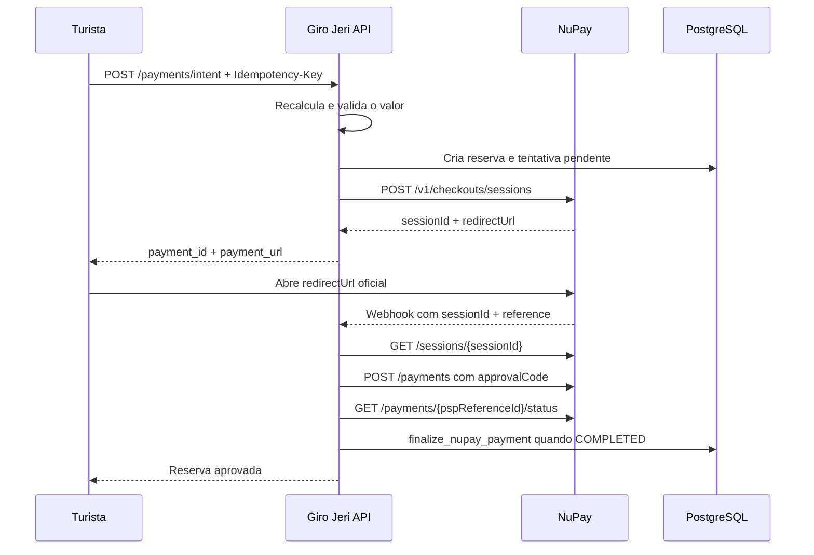

# NuPay no Giro Jeri

## Estado da integração

O Giro Jeri usa o fluxo de **Sessões NuPay**. A opção começa desabilitada e só
aparece no checkout quando as duas condições abaixo forem verdadeiras:

1. `payment_nupay_enabled=true` em `system_settings`.
2. `NUPAY_ENABLED=true`, `NUPAY_APP_KEY` e `NUPAY_APP_TOKEN` no ambiente da API.

Sem credenciais de sandbox, não habilite a configuração no banco. Não existe
modo mock em runtime.

Documentação oficial:

- [OpenAPI NuPay 1.4](https://docs.nupaybusiness.com.br/checkout/docs/openapi/index.html)
- [Guia de Sessões NuPay](https://docs.nupaybusiness.com.br/checkout/guide/api/nupay-2fa-sessions/README.md)

## Fluxo



Retorno do navegador, polling e webhook chamam a mesma operação idempotente.
`AUTHORIZED` não aprova a reserva; somente `COMPLETED`, obtido diretamente da
NuPay, pode executar `finalize_nupay_payment`.

## Configuração protegida

Configure no secret manager do Render:

```dotenv
NUPAY_ENABLED=false
NUPAY_ENV=sandbox
NUPAY_APP_KEY=
NUPAY_APP_TOKEN=
NUPAY_MERCHANT_NAME=Giro Jeri
NUPAY_TIMEOUT_MS=8000
API_PUBLIC_URL=https://api.example.com
TURISTA_URL=https://app.example.com
```

`NUPAY_ENV` aceita apenas `sandbox` ou `production`. `API_PUBLIC_URL` e
`TURISTA_URL` precisam ser HTTPS. Nunca grave credenciais NuPay em
`system_settings`.

## Rotas

| Rota | Autorização | Função |
| --- | --- | --- |
| `POST /api/payments/intent` | Dono | Cria reserva, tentativa e sessão |
| `POST /api/payments/nupay/complete` | Dono | Consulta sessão e pagamento |
| `GET /api/payments/:id/status` | Dono | Polling autenticado |
| `POST /api/payments/:id/cancel` | Dono | Expira sessão ou cancela pagamento pendente |
| `POST /api/payments/:id/refund` | Admin | Solicita estorno integral |
| `POST /api/payments/nupay/webhook` | Público | Gatilho de consulta da sessão |
| `POST /api/payments/nupay/payment-webhook` | Público | Gatilho de consulta do pagamento |

`POST /api/payments/intent` exige `Idempotency-Key` com 16 a 200 caracteres
alfanuméricos, `:`, `_` ou `-`.

Os webhooks não confiam em status, valor ou código de aprovação recebidos. Eles
aceitam identificadores, localizam a tentativa e consultam a NuPay com as
credenciais do servidor.

## Dados e privacidade

A migration `023_nupay_sessions_hardening.sql`:

- adiciona IDs de sessão/transação, status do provedor, idempotência e falha;
- cria índices únicos e limita uma tentativa NuPay pendente por reserva;
- remove credenciais NuPay legadas de `system_settings`;
- cria as funções atômicas de aprovação e estorno;
- mantém `payment_nupay_enabled=false`.

Persistir somente IDs, status, códigos e timestamps. Não armazenar CPF, nome,
e-mail, telefone, IP, tokens, payload completo ou código de aprovação em
`raw_response_json`, `payment_events` ou logs.

## Estados

| Estado NuPay | Estado local | Reserva |
| --- | --- | --- |
| Sessão pendente/aprovada | `pending` | `awaiting_payment` |
| `AUTHORIZED` | `pending` | `awaiting_payment` |
| `COMPLETED` | `approved` | `paid` |
| Sessão expirada | `expired` | `awaiting_payment` |
| Cancelado/negado | `failed` | `awaiting_payment` |
| `REFUNDED` | `refunded` | `refunded` |

Expiração, inelegibilidade e recusa não alteram a reserva para um estado
comercial terminal. O turista pode escolher PIX ou iniciar nova tentativa.

## Homologação

Execute as migrations em ordem (`021`, `022`, `023`) em banco limpo e também
valide a `023` sobre uma base onde `021/022` já tenham sido aplicadas.

No sandbox:

1. Criar uma sessão e conferir valor, moeda, referência e expiração.
2. Aprovar débito e crédito disponibilizados pela conta.
3. Confirmar que `AUTHORIZED` permanece pendente.
4. Confirmar que `COMPLETED` cria uma aprovação, um conjunto de ledger e um e-mail.
5. Repetir webhook, retorno e polling simultaneamente.
6. Cancelar sessão pendente e pagamento pendente.
7. Expirar sessão e pagar a mesma reserva via PIX.
8. Simular `412`, `409`, `429`, timeout e indisponibilidade.
9. Estornar integralmente e conferir reserva e ledger.
10. Confirmar que outro usuário recebe `404` ao consultar ou cancelar.

## Ativação em produção

Antes de alterar `NUPAY_ENABLED`:

- contrato de Sessões NuPay aprovado no onboarding;
- credenciais de produção validadas;
- URLs HTTPS cadastradas e callbacks recebidos;
- roteiro de sandbox aprovado;
- alertas para `5xx`, `429`, timeout e divergência de valor/referência;
- dashboard para tentativas pendentes por mais de 30 minutos;
- procedimento de desativação testado.

Para desativar sem deploy, defina `payment_nupay_enabled=false`. Para bloqueio
operacional completo, use também `NUPAY_ENABLED=false`.
